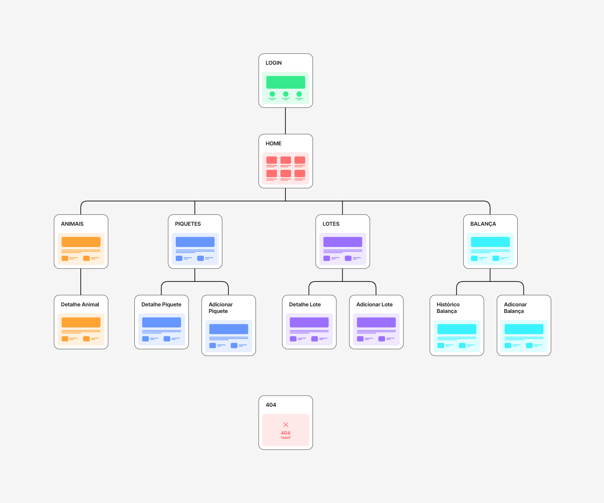

# INTELICAMPO - Documentação do Mapa do Site da Aplicação Web

## Visão Geral

Este documento detalha o mapa do site de uma aplicação web projetada para a gestão de animais, piquetes, lotes e acompanhamento de balança.

## Índice
- [Login](#login)
- [Início](#início-home)
- [Animais](#animais)
- [Piquetes](#piquetes)
- [Lotes](#lotes)
- [Balança](#balança)
- [Tratamento de Erros](#tratamento-de-erros)

## Login
Tela de Login: O ponto de entrada da aplicação que requer autenticação do usuário.

## Início (Home)
Tela Inicial: O painel central que fornece navegação para as principais seções da aplicação.

### Funcionalidades
  - **Fazenda**: Acesso rápido a dados específicos da fazenda.
  - **Animais**: Direciona para a seção de gestão de animais.
  - **Piquete**: Direciona para a seção de gestão de piquetes.
  - **Lote**: Direciona para a seção de gestão de lotes.
  - **Balança**: Direciona para a seção de acompanhamento de balança.

## Animais
  - **Listar Animais (Lista Animais)**: Exibe uma lista de todos os animais presentes no sistema.
  - **Detalhes do Animal (Detalhe Animal)**: Mostra informações detalhadas sobre um animal específico.
  - **Histórico do Animal (Hist. Animal)**: Mostra dados históricos relacionados ao animal selecionado.
  - **Filtros de Animal (Filtros Animal)**: Permite aos usuários filtrar a lista de animais com base em critérios específicos.
  - **Erro 404**: Exibe uma página de erro se a informação do animal solicitado não for encontrada.

## Piquetes
  - **Listar Piquetes (Lista Piquetes)**: Exibe todos os piquetes disponíveis na aplicação.
  - **Detalhes do Piquete (Detalhe Piquete)**: Fornece informações detalhadas sobre um piquete específico.
  - **Adicionar Piquete**: Um formulário para inserir detalhes de um novo piquete no sistema.
  - **Histórico do Piquete (Hist. Piquete)**: Acesso a dados históricos dos piquetes.

## Lotes
  - **Listar Lotes (Lista Lotes)**: Uma compilação de diferentes lotes.
  - **Detalhes do Lote (Detalhe Lote)**: Oferece informações detalhadas sobre lotes selecionados.
  - **Adicionar Lote**: Interface para adicionar novos lotes.
  - **Histórico do Lote (Hist. Lote)**: Apresenta dados e registros históricos para os lotes.

## Balança
  - **Listar Balanças (Lista Balanças)**: Visão geral de todas as entradas relacionadas à balança.
  - **Adicionar Balança**: Função para adicionar novas entradas de balança.
  - **Editar Balança**: Editar registros existentes de balança.
  - **Deletar Balança**: Remover entradas de balança do sistema.
  - **Histórico da Balança (Histórico Balança)**: Revisar dados históricos da balança.
  - **Relatório da Balança (Relatório Balança)**: Gera relatórios baseados em dados da balança.

## Tratamento de Erros
  - **Página de Erro 404**: Informa aos usuários que a página ou recurso que estão procurando não pode ser encontrado.

## Conclusão
Este documento serve como um ponto de partida para a documentação detalhada da aplicação web.

# Licença
O código-fonte deste projeto está licenciado sob a Licença MIT, que permite reutilização, distribuição e modificação com poucas restrições. Uma cópia da licença segue abaixo:

